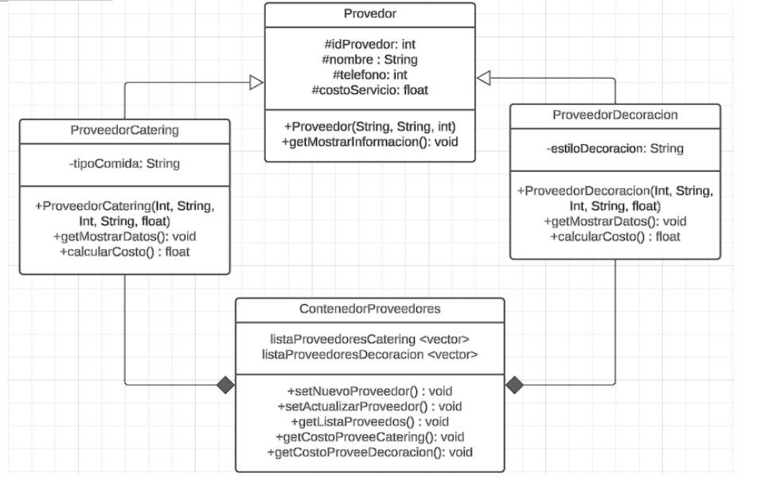

# Proyecto: Eventos a Todo Dar

La empresa **Eventos a Todo Dar** se dedica a la organización de eventos y la gestión de proveedores. Se requiere almacenar la información sobre los distintos tipos de proveedores que la empresa utiliza para sus eventos y calcular el costo total de sus servicios.

## Clases a Definir

### Clase Base: Proveedor (10 puntos)

**Atributos (4 puntos):**

- `idProveedor`: String
- `nombre`: String
- `numeroContacto`: int
- `costoPorServicio`: float

**Métodos (6 puntos):**

- **Constructor**: que recibe por parámetro e inicializa los atributos. (3 puntos)
- **getMostrarInformacion()**: Muestra la información básica del proveedor. (3 puntos)

### Clase Derivada: ProveedorCatering (9 puntos)

**Atributos (1 punto):**

- `tipoComida`: String

**Métodos (8 puntos):**

- **calcularCostoTotal()**: Calcula el costo total multiplicando el costo por servicio por el número de invitados según el proveedor seleccionado. (5 puntos)
- **mostrarInformacion()**: Muestra la información del proveedor de catering. (3 puntos)

### Clase Derivada: ProveedorDecoracion (9 puntos)

**Atributos (1 punto):**

- `estiloDecoracion`: String

**Métodos (6 puntos):**

- **calcularCostoTotal()**: Calcula el costo total multiplicando el costo por servicio por el tamaño del espacio en metros cuadrados según el proveedor seleccionado. (5 puntos)
- **mostrarInformacion()**: Muestra la información del proveedor de decoración. (3 puntos)

### Clase ContenedorProveedores (48 puntos)

**Atributos (6 puntos):**

- `listaProveedoresCatering`: Vector (almacena los proveedores de tipo catering). (3 puntos)
- `listaProveedoresDecoracion`: Vector (almacena los proveedores de tipo decoración). (3 puntos)

**Métodos (42 puntos):**

- **setNuevoProveedor()**: Agrega un nuevo proveedor a la lista correspondiente (catering o decoración). (3 puntos)
  - Debe validar que no permita ingresar proveedores con el mismo ID. (6 puntos)
- **setActualizarProveedor()**: Actualiza la información de un proveedor existente basado en su ID. (8 puntos)
  - (No se puede actualizar el ID; si el proveedor no se encuentra, deberá indicarlo).
- **getListaDeProveedores()**: Devuelve una lista de todos los proveedores, incluyendo sus detalles. (5 puntos)
- **getCostoProveedor()**: Permite seleccionar un proveedor específico según su tipo y solicita el tamaño del espacio o el número de clientes según el tipo de proveedor seleccionado (Catering o Decoración). (20 puntos)
  - Selección del Tipo de Proveedor. (4 puntos)
  - Solicitud de Información Necesaria. (6 puntos)
  - Cálculo del Costo Total. (6 puntos)

## Requerimientos del Sistema (15 puntos)

Se debe crear un menú interactivo que permita al usuario:

1. Agregar un nuevo proveedor (catering o decoración). (3 puntos)
2. Actualizar la información de un proveedor existente. (3 puntos)
3. Mostrar la lista de todos los proveedores disponibles. (3 puntos)
4. Calcular el costo total de los servicios de un proveedor específico, solicitando los datos necesarios (número de invitados o tamaño del espacio). (3 puntos)
5. Salir del programa.

**Comentarios en el código (3 puntos)**

> **Nota:** Considere agregar los métodos adicionales que considere necesarios para cumplir con los requerimientos del sistema. Además, no se pueden utilizar formas de iterar o procedimientos no vistos en clase; en caso contrario, no se tomará en cuenta lo implementado.
